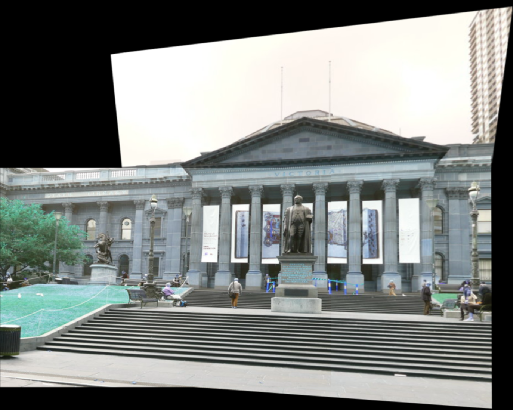
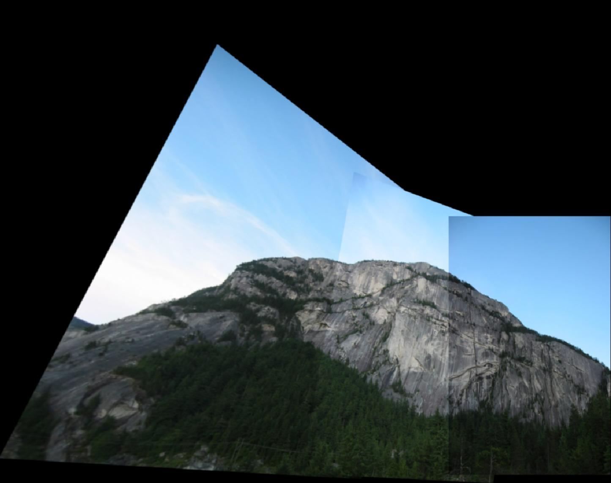
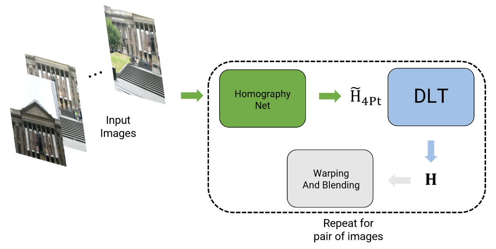

# AutoPanorama: Classic and Deep Learning-based Image Stitching

This project demonstrates two approaches for automatic panorama creation. The first uses traditional computer vision methods (Harris Corner Detection, ANMS, RANSAC), while the second employs deep learning (HomographyNet) for homography estimation. The goal is to stitch multiple overlapping images into a single panoramic view.

---

## Phase 1: Classical Image Stitching

1. **Corner Detection**  
   - Uses Harris Corner Detection to locate potential keypoints in grayscale images.  
   - Adaptive Non-Max Suppression (ANMS) removes redundant or duplicate corner detections.

2. **Feature Descriptors & Matching**  
   - A blurred, downsampled patch around each detected feature is converted into a fixed-size descriptor.  
   - Brute-force matching uses the Sum of Squared Differences (SSD) and ratio test to identify the best candidate matches.

3. **RANSAC for Homography**  
   - Randomly selects small sets of feature matches to compute homographies.  
   - Retains the homography with the largest consensus set (inliers).

4. **Warping & Stitching**  
   - **Approach 1**: Sequentially warp each new image to the reference frame of the previous stitch.  
   - **Approach 2**: Compute all consecutive homographies in advance, then warp each image.  
   - Approach 1 generally offers better performance by reducing error propagation.

Example stitched results:

<p align="center">
  
  
</p>

---

### Running the Classical Stitching Code
1. Navigate to the folder containing `Wrapper.py`.
2. Update the `path_to_images` variable in `Wrapper.py` (line 244).
3. Run:
   ```bash
   cd Phase1/Code/
   python3 Wrapper.py
   ```

---

## Phase 2: Deep Learning for Homography Estimation

This phase uses a network inspired by HomographyNet to predict homographies between pairs of image patches. Both **supervised** (with ground-truth) and **unsupervised** (photometric loss) methods are demonstrated.

1. **Data Generation**  
   - Extract patches from MS COCO images.  
   - Perturb patch corners by a fixed amount (e.g., 16 pixels).  
   - Concatenate original and warped patches into 2-channel images.

2. **Network Architecture**  
   - 8 convolutional layers with 3×3 kernels, BatchNorm, and ReLU activation.  
   - Max pooling after every two convolutional layers.  
   - Two fully connected layers (1024 units in the first) with dropout.  
   - Outputs four corner offsets (H4pt), used to build the 3×3 homography.

3. **Training**  
   - **Supervised**: Minimizes RMSE loss between predicted and ground-truth corner offsets.  
   - **Unsupervised**: Uses TensorDLT and a Spatial Transformer Network (STN) to warp images, optimizing photometric loss without direct ground-truth.

<p align="center">
  
</p>

Example predictions: the red patch is ground truth; the blue patch is model output. Supervised approaches converge well, while unsupervised methods can overfit shape unless given sufficient training data.

---

### Running the Deep Learning Code

1. **Data Generation**  
   ```bash
   python3 Phase2/Code/Wrapper.py
   ```
   Make sure the train and test images are in `Phase2/Data/`.

2. **Training**  
   ```bash
   # Supervised
   python3 Phase2/Code/Train.py --NumEpochs 25 --ModelType Sup
   
   # Unsupervised
   python3 Phase2/Code/Train.py --NumEpochs 25 --ModelType UnSup
   ```

3. **Testing**  
   ```bash
   python3 Phase2/Code/Test.py
   ```
   Adjust paths and architectures in `Network.py`, `Train.py`, and `Test.py` if necessary.  